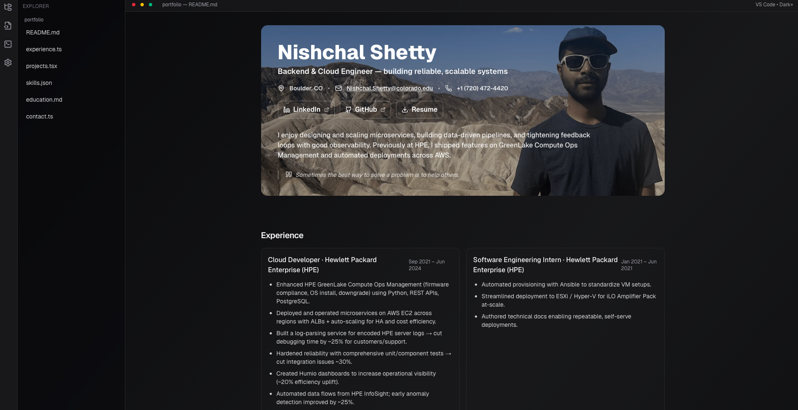

# 🚀 Portfolio — Nishchal Shetty

A modern, fast **Next.js + TailwindCSS** portfolio that highlights my experience, skills, and selected projects — inspired by a VS-Code aesthetic with smooth motion and clean typography.

> **Live Demo:** https://nishchalshetty.vercel.app


---

## ✨ Tech Stack

- **Framework:** Next.js 14 (App Router)
- **Styling:** Tailwind CSS v4
- **UI:** shadcn/ui + lucide-react icons
- **Animation:** Framer Motion
- **Deploy:** Vercel (free)

---

## 🌟 Features

- ⚡ Blazing-fast, responsive layout (mobile → desktop)  
- 🖼️ Hero section with full-bleed personal photo background  
- 🌓 Dark theme (default) with bold, high-contrast text  
- 🧩 Reusable UI chips/cards; clean, accessible HTML  
- 📄 One-click resume download
- 🔁 CI-like auto-deploys on every push via Vercel

---

## 📸 Screenshot




---

## 📂 Project Structure

```bash
src/
  app/
    layout.tsx      # global layout, fonts, metadata
    page.tsx        # main portfolio page (hero, experience, projects, skills, contact)
  components/
    ui/             # shadcn/ui components (button, card, badge, input, tabs, etc.)
public/
  myimage.png          # hero background image (your photo)
  resume.pdf  # resume file
